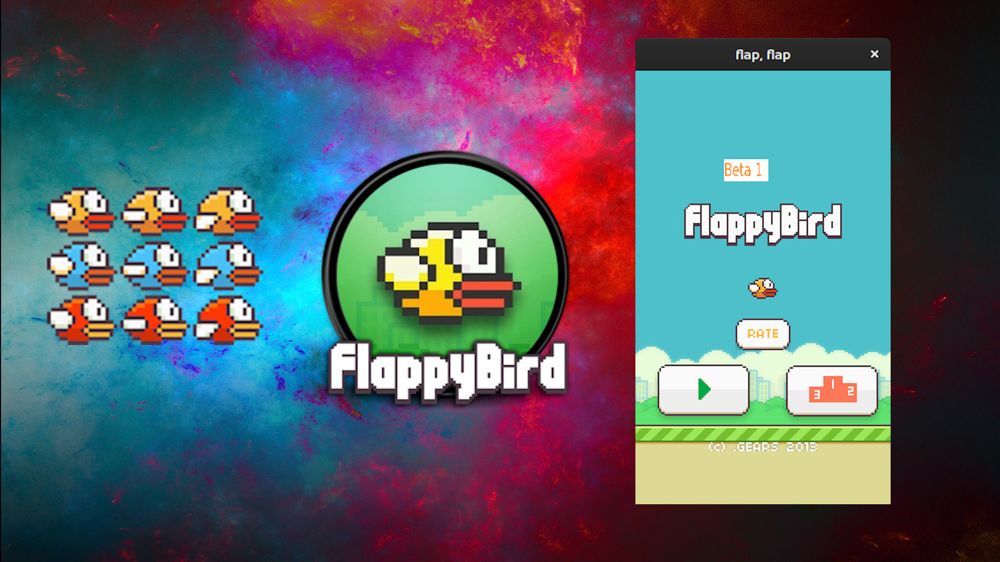

### Demo Video
<video src="assets/vids/Flappy Promo.mp4" poster="assets/ss/Flappy Promo.jpg" width="288" height="490" controls preload></video>

### Features
Original Assets, Scalable, Pausable, 2 Backgrounds, 3 Bird Colors, Bitmap Fonts, Tiny and Fast Executable, Detailed Step by Step Dev-Guide.

### Notes
This is quickly implemented proof of concept Code done in 2017. It should run on Android / Windows & Linux - should be easily portable to Mac/iOS. See more Details and Downloads in the Repository.

### Downloads
* Android [Dropbox](https://www.dropbox.com/s/mpin68zb252a84z/SDLActivity-debug-1.apk?dl=0)
* Windows [Dropbox](https://www.dropbox.com/s/w3v6831j8sjy1zs/flap.7z?dl=0)