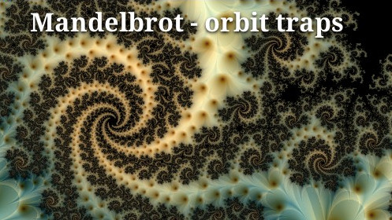

Welcome!  
This is my effort to make coding with pure C and SDL2 more clear und fun.  
Why C? Cause C is seeing! =).  
You should have a working C-Environment and [SDL2 Devlopment Libs](https://www.libsdl.org/download-2.0.php) installed; preferable some of the extensions to SDL, like [Mixer](https://www.libsdl.org/projects/SDL_mixer/), [Image](https://www.libsdl.org/projects/SDL_image/) and [TTF](https://www.libsdl.org/projects/SDL_ttf/).

If you struggle to get things up and running, refer to one of those pages:
[Will Usher](https://www.willusher.io/sdl2%20tutorials/2013/08/15/lesson-0-setting-up-sdl) or
[Lazy Foo](http://lazyfoo.net/tutorials/SDL/01_hello_SDL/index.php).  
**For Mac OS**: Setting Up An SDL2 Project [in Xcode 9](http://matthewstyles.com/set-up-an-sdl2-project-in-xcode/) or [without Xcode](https://medium.com/@edkins.sarah/set-up-sdl2-on-your-mac-without-xcode-6b0c33b723f7).  
And if you wish to use **SDL2 with CMake**: [Trenki's Dev Blog](https://trenki2.github.io/blog/2017/06/02/using-sdl2-with-cmake/)  

I am trying to cover the [SDL2-API](https://wiki.libsdl.org/APIByCategory) as needed, OpenGL, Vulkan and a couple of other common API's like curl or jannson, tho this is pure C and mainly Linux orientated, doesn't mean I don't cross-compile for Windows or Android. If you need a german translation I could make that happen. SDL-Audio Series and Joystick/Gamecontroller Series are nearly finished, just polishing it. At the same time I am building up my [C-Snippets](https://gist.github.com/Acry/554e04bab3a2669a5ba2ecd4d673e875), but I am pretty behind on that. [SDL_net 2.0](https://www.libsdl.org/projects/SDL_net/) isn't covered yet.  

Feel free to [contact me](https://discourse.libsdl.org/u/Acry/summary) for criticism, Demo Requests or whatever!  
Oh, you can use the code as you wish, but don't blame me!  
*Happy hacking!*  

## C-Code:
[Shade it!](https://github.com/Acry/Shade-it-)  
{:height="200px" width="320px"}  
Using SDL2 to show [Shadertoy](https://www.shadertoy.com/) GLSL Fragment Shaders.
Features "drag and drop", Auto-Screenshot with shadername, editing with Auto-Compile.  
WIP: Finishing SDL2-Audio right now, to move on to FFT and finally implement 
visualization of GLSL shaders with low latency.  

### Entry Level
[SDL2-Surfaces](https://github.com/Acry/SDL2-Surfaces)
<video src="assets/vids/surfaces.mp4" poster="assets/ss/surfaces.jpg" width="320" height="200" controls preload></video>
This is a set of small introductory programs.  
It's about the window, the window icon, a custom cursor, surfaces,  
Pixel Manipulation and how to save a screenshot.

[SDL2-Renderer](https://github.com/Acry/SDL2-Renderer)  
This is a series about the SDL2-Renderer.  
Create a Texture from Surface and Render it or flip, mirror rotate it.  
Take Screenshot with RenderReadPixels.  
Render and animate a colorful gradient like a new shadertoy one.  
Shows a bit how glsl works and why we want shaders.  

[SDL2-Timer-01](https://github.com/Acry/SDL2-Timer-01)  
Records the duration how long left MouseButton is pressed.

[SDL2-Timer-02](https://github.com/Acry/SDL2-Timer-02)  
SDL2-Timing: Program quits after a certain amount of time.

[SDL2-SpriteAnim](https://github.com/Acry/SDL2-Anim01)  
<video src="assets/vids/sprite_animation.mp4" poster="assets/ss/sprite_animation.jpg" width="320" height="200" controls preload></video>
Create Spritesheet from gif and render that timed.  

[SDL2-GUI-Button](https://github.com/Acry/SDL2-GUI-Button)  
responsive Button

[SDL2-Mousegrab](https://github.com/Acry/SDL2-Mousegrab)  
<video src="assets/vids/mouse_grab.mp4" poster="assets/ss/mouse_grab.jpg" width="320" height="200" controls preload></video>
Let rect follow the mouse  

[SDL2-DnD](https://github.com/Acry/SDL2-DnD)  
Drag and Drop. Receiving Text and Files via SDL_DropEvent.  

[Play music with SDL2](https://github.com/Acry/SDL2-Mixer-play_music_mp3)  
use of SDL-Mixer for Music

[SDL2-Mixer-play_mp3](https://github.com/Acry/SDL2-Mixer-play_mp3)  
use of SDL-Mixer for Sound

### Basic-Level:
[SDL2_simple_music_player](https://github.com/Acry/SDL2_simple_music_player)  
use of SDL-Mixer and GUI-Elements

[SDL2-Parallax-02](https://github.com/Acry/SDL2-Parallax-02)  
rapid Parallax implementation with 6 Layers

[SDL2-Titlebar](https://github.com/Acry/SDL2-Titlebar)  
roll your own titlebar  

[SDL2-TTF](https://github.com/Acry/SDL2-TTF)    
This is a C-SDL2 series about the SDL-Extension SDL_ttf 2.0  

[SDL2-Textures](https://github.com/Acry/SDL2-Textures)  
Procedural/algorithmic Textures with SDL2.  

[SDL2-Game-Physics](https://github.com/Acry/SDL2-Physics)  
This is a series about physics - SI-Units, Velocity, Acceleration, Gravity, Friction etc.  

[SDL2-Game-AI](https://github.com/Acry/AI)  
This is an introductory series about Artificial intelligence (AI).  

[SDL2-Slider](https://github.com/Acry/SDL2-Slider)  
It is a follow up from Mousegrab. Shows how to make a Slider.  

[SDL2-Curves](https://github.com/Acry/SDL2-Curves)  
How to apply De Casteljau's algorithm on a quadratic Bézier curve.  

[SDL2-create_tex_part_of_win](https://github.com/Acry/SDL2-create_tex_part_of_win)  
Re-Render a part of the screen using SetRenderTarget and SDL_TEXTUREACCESS_TARGET.

[SDL2-TextureColorMod](https://github.com/Acry/SDL2-TextureColorMod)
<video src="assets/vids/colormod.mp4" poster="assets/ss/colormod.jpg" width="320" height="200" controls preload></video>
This small demo shows how to use [TextureColorMod](https://wiki.libsdl.org/SDL_GetTextureColorMod?action=fullsearch&context=180&value=TextureColorMod&titlesearch=Titles).  

[Pong](https://github.com/Acry/SDL2-Pong)  
<video src="assets/vids/pong.mp4" poster="assets/ss/pong.jpg" width="320" height="200" controls preload></video>
My scaleable Pong implementation. You can take over two player control anytime, the AI will take over if you go afk. A [mingw](www.mingw.org/) Windows 64 build is in the Makefile.  

### Advanced in C
You need to fully understand pointers, dynamic memory allocation and bit operations.  
[SDL2-Text](https://github.com/Acry/SDL2-Text)  
This is a small SDL2 text API demo  

[SDL2-OpenGL](https://github.com/Acry/SDL2-OpenGL)  
This is a starter series about GLSL Shaders using SDL2 as OpenGL Helper and a bit Shader-Language for C-Coders.  

[NanoVG-SDL2 starter](https://github.com/Acry/SDL2-nanovg-example)  
Startup Code to use SDL2/OpenGL/NanoVG  

[SDL2-Demo-01](https://github.com/Acry/SDL2-Demo-01)  
Demo with a couple of features.

[Byte_Drawer](https://github.com/Acry/Byte_Drawer)  
Flipping Bits on a real char and visualize that.

### C&C++ mixed Code:
[Classic Pong and Breakout stuff](https://github.com/Acry/SDL2-pong_issue-01)  
Ressources covering Atari's classic game.  

[C++ game engine skeleton](https://github.com/Acry/cpp-game-engine-skel)  
with GNU-Makefile  

### Misc
[My C Code](https://gist.github.com/Acry/554e04bab3a2669a5ba2ecd4d673e875)  
C-Idioms, C-Examples, C-Tutorials, C-Snippets  

[Light Template](https://github.com/Acry/SDL2-C-KDev_App_Template_light)  
SDL2 Template for KDevelop  

[Heavy Template](https://github.com/Acry/SDL2-C-KDev_App_Template)  
SDL2 Template for KDevelop - with TTF & Mixer  

[Simple-state-pattern](https://github.com/Acry/simple-state-pattern)  
High Level Game State Management - Code Flow diagram.

[Game Loots](https://github.com/Acry/Game_loots)  
This guide is intended to get the Idea of random drops
and as introduction to random distribution or weighted distribution.

## External ressources
### C
[Stephen Meier's SDL2 Tutorials](https://www.google.de/search?q=site%3Awww.stephenmeier.net+%22SDL-2-0-Tutorial-%22&oq=site%3Awww.stephenmeier.net+%22SDL-2-0-Tutorial-%22)

SDL Mixer:  
[change Frequency during runtime](https://gist.github.com/danilolc/9fff54a8cb9ddc04b9bd82df7badb610)  

### C++
<http://gigi.nullneuron.net/gigilabs/writing/sdl2-tutorials/>

### Emscripten
[Emscripten and SDL 2 Tutorial](https://lyceum-allotments.github.io/2016/06/emscripten-and-sdl-2-tutorial-part-1/)  

### GameDev
[Amit’s Game Programming Information](http://www-cs-students.stanford.edu/~amitp/gameprog.html)  
[Game Engines Collection](https://github.com/collections/game-engines)  

### CG
[Paul Bourke's on geometry](http://paulbourke.net/geometry/)
[Philip Rideout's blog](http://github.prideout.net/)  
[Lode's Computer Graphics Tutorial](https://lodev.org/cgtutor/)  
[Íñigo Quílez](http://www.iquilezles.org/prods/index.htm)  
[Jon Macey's NGL Demos](https://nccastaff.bmth.ac.uk/jmacey/GraphicsLib/Demos/index.html)

### Audio
[DrPetter's homepage](http://www.drpetter.se/article_sound.html)
